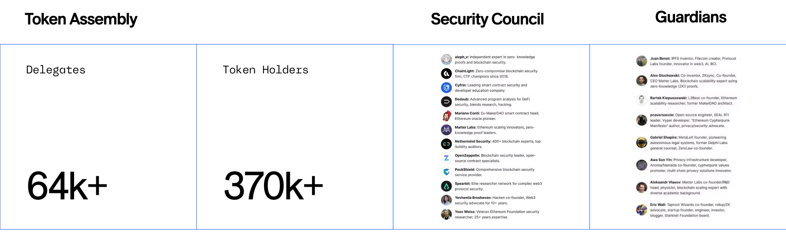
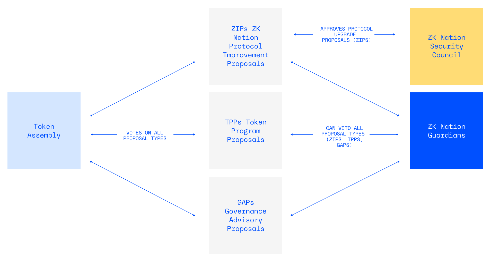
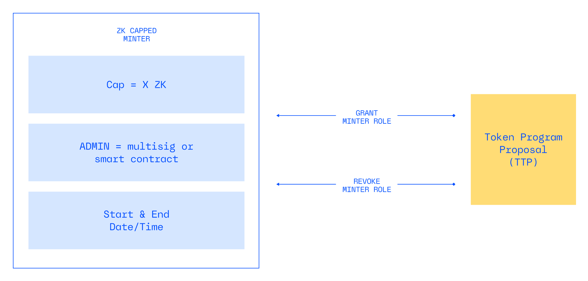

# ZKsync Governance 101

### What does the ZKsync Governance System govern?

> Please refer to [ZKsync Governance Procedures: Overview](https://docs.zknation.io/zksync-governance/zksync-governance-procedures-overview) and [Schedule 1: Standard Governance Procedures](https://docs.zknation.io/zksync-governance/schedule-1-standard-governance-procedures) for more information.

* **ZKsync Protocol:** The ZKsync Governance System governs the ZKsync protocol. The ZKsync protocol is a series of connected smart contracts deployed on Ethereum and on ZKsync Chains themselves (L2 system contracts). The ZKsync Chains (e.g. Era, Abstract, Lens) are built using the ZKsync Stack toolkit and implemented with the ZKsync protocol. Protocol upgrades are approved by passing a ZIP through the Protocol Governor.
* **Token Assembly ZK Token Allocation:** The Token Assembly was given control over 29.3% of the total token supply (21B ZK) at the time of the token launch in June 2024. This allocation is meant to fund initiatives in line with the [ZK Credo](https://docs.zknation.io/zk-nation/mission-zk-credo) and [ZKsync Governance North Star](https://docs.zknation.io/zk-nation/zksync-governance-system-north-star). Proposals that distribute ZK are approved by passing a TPP through the Token Governor.
* **“GovOps” via Governance Advisory Proposals (GAPs):** GAPs provide legitimacy to off-chain decisions through onchain Token Assembly Delegate voting (e.g. ratification of standards & policies, elections)

### Elements of ZKsync Governance

The ZKsync governance system has 3 Governors, 3 proposal types & 3 governance bodies.

**3️⃣ Governors**

The ZKsync governance system utilizes three OZ standard Governors: Protocol Governor, Token Governor, GovOps Governor. Read more about each Governor and find contract addresses [here](https://docs.zknation.io/zksync-governance/zksync-governance-procedures-overview#id-6.-standard-governance-procedures).

Having three separate Governors allows for more flexibility and customization for each Governor. For example, parameters for the Protocol Governor can differ from parameters for the Token Governor.

**3️⃣ Proposal Types**

The ZKsync governance system has three types of proposals at inception:

* **ZKsync Improvement Proposals ("ZIPs")**: These proposals outline changes to the ZKsync protocol contracts via the Protocol Upgrade Governor.
* **Token Program Proposals (”TPPs”)**: These proposals activate new mechanics through which the ZK token is minted and burned by participants who are actively developing the ZKsync ecosystem.
* **Governance Advisory Proposals (”GAPs”)**: These proposals specify offchain decisions and actions that require approval by the Token Assembly, but are not directly related to the ZKsync protocol or the ZK token. For example: ratifications, elections, or other decisions requiring onchain voting.

All proposals are managed by ZKsync governance smart contracts that operate directly onchain. The parameters of these governors, such as voting periods and timelocks, are specified in the [ZKsync Governance Procedures](https://docs.zknation.io/zksync-governance/zksync-governance-procedures-overview).

**3️⃣ Governance Bodies**

The ZKsync Governance system is governed by three governance bodies: The Token Assembly, ZKsync Security Council, and ZKsync Guardians. Read more about the three governance bodies [here](https://docs.zknation.io/zksync-governance/zksync-governance-procedures-overview#id-4.-governance-bodies).

<figure><figcaption></figcaption></figure>

### How do the governance bodies interact with each proposal type?

<figure><figcaption></figcaption></figure>

### Where is ZKsync governance deployed?

> ℹ️ Find all relevant governance contract addresses [here](https://docs.zknation.io/zk-nation/zksync-governance-contract-addresses). The source code is available in the [zk-governance repo](https://github.com/zksync-association/zk-governance).

The ZK token is deployed on Era. Read more [here](https://docs.zknation.io/zk-token/zk-token). All Governor contracts are deployed on Era and Ethereum.

* Era: The Governor contracts that allow Token Assembly to voting on proposals.
  * ZkToken Governor
  * ZkProtocol Governor
  * ZkGovOps Governor
* Ethereum: Contracts that enable L1 execution of ZKsync Improvement Proposals (ZIPs)
  * Protocol Upgrade Handler
  * Emergency Upgrade Board - contracts responsible for accepting approvals from all Governance bodies (ZkProtocolGovernor voting result, Seurity Council, Guardians, Foundation) and making the upgrades.

The ZKsync Association was responsible for deploying all governance contracts. This is one reason why the ZKsync Association is considered the “utility provider” for the governance system.

### How are token allocation through governance different at ZKsync than other onchain organizations?

#### **Capped Minters**

As outlined in [ZK Token page](https://docs.zknation.io/zk-token/zk-token#capped-minters), not all ZK tokens were minted at launch. The total supply of the ZK token is managed in the [ZK token contract](https://explorer.zksync.io/token/0x5A7d6b2F92C77FAD6CCaBd7EE0624E64907Eaf3E#contract#read-proxy). ZKsync uses **capped minter** contracts to request to mint new ZK tokens, enabling “just-in-time minting.”

Each capped minter receives a maximum number of tokens they are allowed to mint. Anyone with the minter role on a capped minter contract can then mint tokens from that supply whenever they choose to, up to the maximum “cap” specified. This design removes the risks associated with a large treasury and instead shifts the agency of token management to the capped minters.

#### **Token Program Proposals (TPPs)**

In the ZKsync governance framework, **Token Program Proposals (TPPs)** are used to assign minting and burning rights of ZK tokens to specified capped minters, and activate new token mechanics.

A program can have one or multiple capped minters. It is also possible to nest “child” capped minters under “parent” capped minters. Learn more about capped minter V2 contracts [here](https://forum.zknation.io/t/zk-capped-minter-v2-nested-minters-start-time-expiration-pause-and-cancel/417).

Capped minters for a program have to be deployed before a TPP is submitted onchain. Capped minters can be assigned an admin, cap, start and stop time upon deployment. Learn more about how to deploy a capped minter in the V2 factory [here](https://forum.zknation.io/t/zk-capped-minter-v2-nested-minters-start-time-expiration-pause-and-cancel/417#p-997-capped-minter-v2-deployment-verification-instructions-3).

Capped minters are granted the MINTER role from the ZK token contract when the Token Assembly successfully passes a TPP.

<figure><figcaption></figcaption></figure>

#### **Token Programs Standards**

Token Program design standards are different than funding proposals in other ecosystems. Key elements of Token Program standards:

* Support Governance North Star metrics / Token Assembly Priorities (see GAP-1)
* Reward onchain, verifiable metrics
* Automation in distribution > reduction of reliance on manual execution
* Rewarding multiple participants working towards similar goal/metric > rewarding one specific party

Read more about Token Programs, token mechanics in this [TPP FAQ](https://forum.zknation.io/t/tpp-frequently-asked-questions/141) and the [TPP Guidelines](https://docs.zknation.io/zksync-governance-proposals/token-program-proposals-tpps) in the docs.
