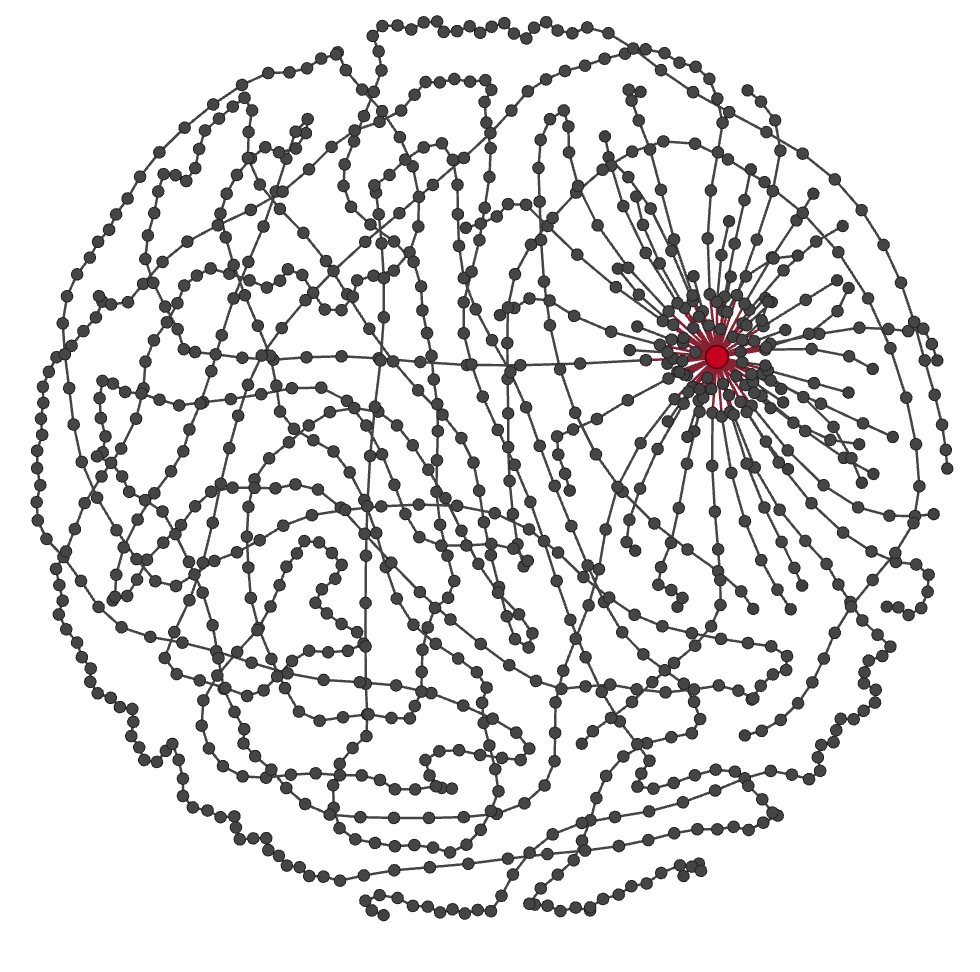

# ZK Airdrop


Certain jurisdictions are blocked from the ZK airdrop, these include: Cuba; Iran; North Korea; Russia; Syria; specific regions of Ukraine: Crimea, Donetsk and Luhansk. These geographical regions must be blocked to comply with the sanctions regulations set forth by the U.S. Department of Treasury’s Office of Foreign Assets Control (“OFAC”), the United Nations Security Council (“UNSC”), the European External Action Service (“EEAS”), and His Majesty’s Treasury (“HMT), which mandate the prohibition of providing product or services accessible from domains to persons from specific countries and territories. Additionally, persons residing in the United States will also be prohibited from participating in the airdrop.


<figure><figcaption></figcaption></figure>

| Category                                                                                                     | Data                                                                                                                                                                                                              |
| ------------------------------------------------------------------------------------------------------------ | ----------------------------------------------------------------------------------------------------------------------------------------------------------------------------------------------------------------- |
| Snapshot Date                                                                                                | 
March 24, 2024 00:00:00 UTC 

Era Block Number: <a href="https://era.zksync.network/block/29710983">29710983</a>  Lite Block Number: <a href="https://zkscan.io/explorer/blocks/187273">187273</a>
 |
| ZKsync user claim start                                                                                      | Week of June 17th, 2024                                                                                                                                                                                           |
| ZKsync user claim end                                                                                        | January 3rd, 2025                                                                                                                                                                                                 |
| Total token amount                                                                                           | 3,675,000,000                                                                                                                                                                                                     |
| [Total eligible wallets](https://github.com/ZKsync-Association/zknation-data/blob/main/eligibility_list.csv) | 695,232                                                                                                                                                                                                           |

There are two ways in which wallets qualified for the 17.5% airdrop:

* **Users** (89%): ZKsync users who bridged funds onto ZKsync Era and met at least one of the [seven eligibility criteria](zk-airdrop.md#step-1-eligibility).
* **Contributors** (11%): Individuals, developers, researchers, communities, and companies who contributed to the ZKsync ecosystem and protocol through development, advocacy, education or participation regardless of their ZKsync network usage.

## Usage-Based Airdrop

Eligibility and allocations for ZKsync users had four sequential steps:

1. **Eligibility**: Every address that has ever transacted on ZKsync Era and ZKsync Lite was checked against eligibility criteria.
2. **Allocation**: A value-scaling formula adjusts an address’s allocation based on amounts sent to ZKsync Era and how long those crypto-assets have stayed on the wallet.
3. **Multipliers**: Addresses that met certain criteria could receive multipliers on their allocation.
4. **Sybil Detection**: A standard sybil filtering methodology applied heuristics to detect bot behavior.

### Step 1: Eligibility

Every address that has ever bridged funds into ZKsync Era was checked against eligibility criteria that identifies people who thoughtfully spent time exploring ZKsync. **Each address must have at least one point to be eligible for the airdrop.**

| Name                    | Network     | Description                                                                                                                          | Point Value |
| ----------------------- | ----------- | ------------------------------------------------------------------------------------------------------------------------------------ | ----------- |
| Contract Interactions   | ZKsync Era  | Interacted with at least 10 non-token smart contracts on ZKsync Era. (Eligible contracts must have had at least 30 days of activity) | 1           |
| Paymaster Activity      | ZKsync Era  | Used paymasters for at least 5 transactions on ZKsync Era                                                                            | 1           |
| Token Trader            | ZKsync Era  | Traded at least 10 distinct ERC-20 tokens on ZKsync Era DEXs                                                                         | 1           |
| DeFi Liquidity Provider | ZKsync Era  | Provided any amount of liquidity to tracked DEXs and Borrow/Lend protocols on ZKsync Era                                             | 1           |
| Libertas Omnibus Holder | ZKsync Era  | Held at least 1 Libertas Omnibus NFT at snapshot                                                                                     | 1           |
| ZKsync Lite Activity    | ZKsync Lite | Active for more than 3 distinct months on ZKsync Lite before ZKsync Era mainnet                                                      | 1           |
| Gitcoin Donor           | ZKsync Lite | Donated to Gitcoin via rounds hosted on ZKsync Lite                                                                                  | 1           |

### Step 2: Allocation

Allocations for eligible addresses was based on a **value-scaling** formula. This formula adjusts an address’s allocation based on amounts sent to ZKsync Era and how long those crypto-assets have stayed on the wallet. That is to say, an address with 100 USD sent to ZKsync Era at mainnet launch will be weighted more than an address who only put 100 USD a month before snapshot. Crypto-assets held on ZKsync Lite do not count when determining an address’s allocation.

Value scaling is a multi-step process:

1. First, the daily USD balance of crypto-assets held by an address was calculated, including the wallet’s balance or crypto-assets sent to DeFi protocols.
2. Next, to emphasize the increased utility of crypto-assets at work compared to those sitting idly in wallets, crypto-assets in DeFi were valued at 2x their nominal value.
3. Finally, the time weighted average balance was calculated for each wallet by summing the daily balance and dividing by total number of days in the snapshot period. The snapshot period from public mainnet launch of ZKsync Era on March 24, 2023 to March 24, 2024 is 366 days long.

Below are two examples demonstrating how value scaling is calculated and the effect which time, amount of money, and DeFi usage have on the resulting time weighted average balance.

#### **Alice**

Alice sent $100 in crypto-assets to ZKsync Era 250 days before the snapshot was taken. After 50 days, they sent another $100 in crypto-assets and kept it in their wallet for the remainder of the time until snapshot

$$
TWAB = \frac{\$100 * 50 days + \$200 * 200 days}{366 days} = \$122.95
$$

#### **Bob**

Bob sent $1,000 in crypto-assets to ZKsync Era just 25 days before the snapshot was taken. He immediately put $500 in crypto-assets of this into a DEX liquidity pool and left the rest in their wallet where it remained until snapshot.

Recall that crypto-assets in DeFi protocols are weighted at 2 times their nominal value

$$
TWAB = \frac{\$500 * 25 days + \$500 * 25 days * 2}{366 days} = \$102.46
$$

### Step 3: Multipliers

Each address could receive multipliers based on activity that signaled a high likelihood of human behavior or contribution to ZKsync. These multipliers apply on top of eligibility and allocations from ZKsync Era and Lite usage.

These multipliers include:

* Hold one of these ZKsync native NFT collections at snapshot: Dudiez, Hue, Moody Mights, Webears, ZKPENGZ, zkSkulls, or zkVeggies.
  * These seven collections were selected based on having a median trade price of at least $25 and a total trade volume of $20,000 in the 30 days prior to snapshot.
* Hold at least $50 of one of these ZKsync native ERC-20 tokens at snapshot: AAI, HOLD, KOI, MEOW, MUTE, RF, ZF, ZORRO.
  * Similarly to the seven eligible NFT projects above, tokens of the top seven projects ranked by market capitalization at the time of snapshot. Eight tokens are included because KOI and MUTE are the same project
* Smart Contract Wallets created via ZKsync Era native account abstraction.
* Held at least 50% of the ARB/OP/ENS airdrop for more than 90 days after claiming.
* In the first 1,000 addresses to interact with qualifying Ethereum smart contracts at least two times. A qualifying contract is one with at least 100 ETH in transaction fees spend on it.

After Step 3, each address was assigned a token allocation. Addresses had to meet a minimum requirement of 450 ZK and were capped at a maximum of 100,000 ZK. Addresses with fewer than 450 ZK had their tokens recycled back into the pool. Addresses with more than 100,000 ZK had their excess tokens recycled back into the pool as well. These tokens were then redistributed and brought the minimum allocation up to 917 ZK.

### Step 4: Sybil Detection

The combination of eligibility criteria, value scaling, and multipliers eliminated most bot swarms. However, our sybil detection methodology further filtered the remaining bots. It intentionally used a very conservative heuristics framework, to avoid accidentally punishing real people. The core idea is to find large groups of externally owned accounts (EOAs) that are ultimately owned by the same user or entity and filter them from the eligible addresses.

To group EOAs into clusters of common ownership, two heuristics were used:

* CEX deposit address reuse heuristic
* Common funding heuristic

Finally, the clusters from the two heuristics were combined into a single list of EOA clusters, and all the clusters with more than 20 EOAs were filtered.

**CEX Deposit Address Reuse**

The first heuristic leverages centralized exchange (CEX) deposit address reuse. CEXs create deposit addresses for customers to process deposits. Since they usually have a single deposit address per customer, if multiple addresses send crypto-assets to the same deposit address, they are likely all controlled by the same entity.

Using this insight, this heuristic groups EOAs that sent transactions to the same CEX deposit address during a 1 year period.

**Funding Source Patterns**

The second heuristic examines funding patterns. Every time a new address is created, its owner needs to fund it with ETH to pay for transaction fees. If we find a group of EOAs with the same ultimate funder, they are likely owned by the same entity. Concretely, we look for funding transfers of similar amounts that occurred within a predefined time window

<figure><figcaption>
The image above shows an example of a bot swarm detected by this approach. It has 1,029 EOAs that were ultimately funded through a CEX (i.e. the red node).
</figcaption></figure>

## Contribution-Based Airdrop


GitHub Developers and ZKsync GitHub Discussion Helpers must associate their address to their handle by June 25th, 00:00 CEST to claim.\
\
External Projects, Protocol Guild and ZKsync native project contributors will be able to claim starting June 24th, 2024


### **ZKsync Native Projects**

_215,250,000 Tokens_

Allocation directly to the contributors and treasuries of ZKsync native projects building on ZKsync Era, including DeFi protocols, ZKsync chains, NFT collections, marketplaces, infrastructure, gaming, and more. A full list of these projects can be found [here](https://github.com/ZKsync-Association/zknation-data/blob/main/zksync_native_project_list.csv).

### **Builders**&#x20;

_86,895,375 Tokens_

Allocated to individuals, developers, researchers, communities, and companies who contributed to the ZKsync ecosystem and protocol through development, advocacy, or education

| Category                                                           | Description                                                                                                                                                                                                                                                                                                                                                                                                        |
| ------------------------------------------------------------------ | ------------------------------------------------------------------------------------------------------------------------------------------------------------------------------------------------------------------------------------------------------------------------------------------------------------------------------------------------------------------------------------------------------------------ |
| External Projects                                                  | [Contributors and employees of these organizations](https://github.com/ZKsync-Association/zknation-data/blob/main/external_project_list.csv)                                                                                                                                                                                                                                                                       |
| GitHub Developers                                                  | 
<a href="https://github.com/ZKsync-Association/zknation-data/blob/main/github_repo_list.csv">Developers contributing to these repositories</a>  To qualify, a user must have had at least 25 commits across all eligible repos prior to March 24 0:00 UTC, 2024
                                                                                                                                       |
| [Protocol Guild](https://protocol-guild.readthedocs.io/en/latest/) | Ethereum researchers and developers                                                                                                                                                                                                                                                                                                                                                                                |
| ZKsync GitHub Discussion Helpers                                   | Users who meaningfully contributed in discussions on the [ZKsync Community Developer Hub on GitHub](https://github.com/zkSync-Community-Hub/zksync-developers/discussions).                                                                                                                                                                                                                                        |
| ZK Quest Participants                                              | People who participated in the ZK Quest developer activations at Istanbul Devconnect 2023 and/or ETH Denver 2024                                                                                                                                                                                                                                                                                                   |
| Security Researchers                                               | Participants in open security contests hosted by platforms such as Code4rena, Cantina, and Codehawks. To qualify, a user must have had at least $100 earned on Code4rena or Codehawks, or one critical report on Cantina.                                                                                                                                                                                          |
| Community Moderators                                               | Community moderators and members of the zkStars program                                                                                                                                                                                                                                                                                                                                                            |
| ZKsync Event POAPs                                                 | POAPs rewarded to people for in-person events: [102366, ](https://collectors.poap.xyz/drop/102366)[107276, ](https://collectors.poap.xyz/drop/107276)[144302, ](https://collectors.poap.xyz/drop/144302)[144304, ](https://collectors.poap.xyz/drop/144304)[158767, ](https://collectors.poap.xyz/drop/158767)[159713, ](https://collectors.poap.xyz/drop/159713)[173207](https://collectors.poap.xyz/drop/173207) |
| ZK Credo Translators                                               | [ZK Credo](https://github.com/zksync/credo/) language translators                                                                                                                                                                                                                                                                                                                                                  |

### Onchain Communities&#x20;

_102,375,000 tokens_

Allocated to a small group of experimental onchain communities for exploring novel ways to organize using tokens and NFTs.

| **Group**                              | **Description**                                                                                                     |
| -------------------------------------- | ------------------------------------------------------------------------------------------------------------------- |
| $DEGEN Airdrop Recipients              | Recipients of the Season 1 $DEGEN airdrop awarded for being an early user on Farcaster                              |
| $BONSAI Airdrop Recipients             | Recipients of the Season 1 $BONSAI airdrop awarded for being an early user on Lens                                  |
| Crypto The Game                        | Participants in Season 1, Season 2, and the CTG team                                                                |
| Pudgy Penguin and Milady Maker Holders | Holders of Pudgy Penguin or Milady Maker NFTs. Allocations are rewarded on a per-address basis rather than per-NFT. |
