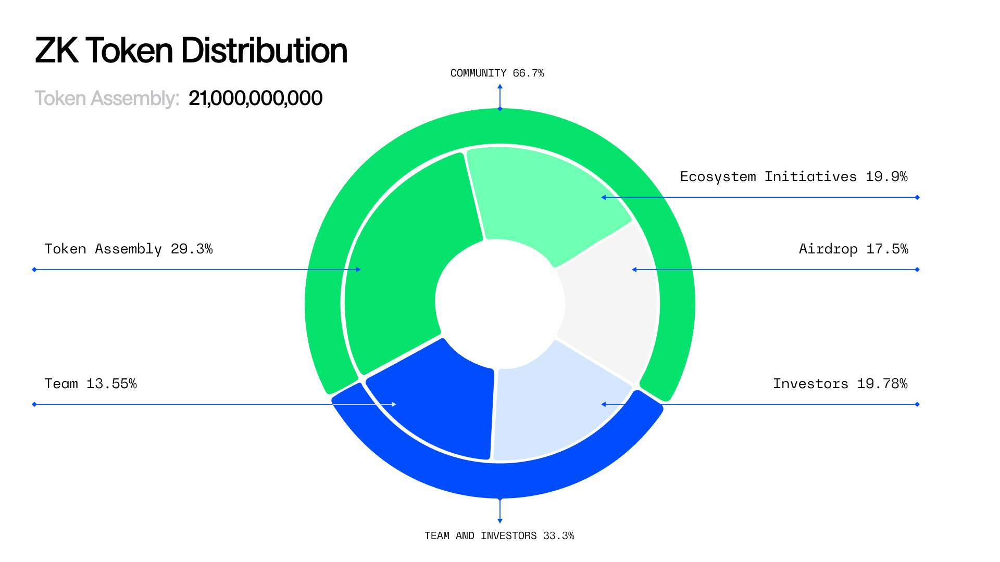

# ZK Token

## Token Properties

<table data-header-hidden><thead><tr><th width="244">Attribute</th><th>Value</th></tr></thead><tbody><tr><td>Token Ticker</td><td>ZK</td></tr><tr><td>Token Address</td><td><a href="https://era.zksync.network/token/0x5A7d6b2F92C77FAD6CCaBd7EE0624E64907Eaf3E">0x5A7d6b2F92C77FAD6CCaBd7EE0624E64907Eaf3E</a></td></tr><tr><td>Supply Cap</td><td>21,000,000,000</td></tr><tr><td>Snapshot</td><td><a href="https://era.zksync.network/block/29710983">29710983</a></td></tr><tr><td>Inflation</td><td>Token supply can be increased through a protocol governance upgrade.</td></tr><tr><td>Deployed on</td><td>ZKsync Era</td></tr><tr><td>Transferrable to Ethereum Mainnet</td><td>Yes</td></tr></tbody></table>

## Token Distribution

<figure><figcaption></figcaption></figure>

<table><thead><tr><th width="152">Category</th><th width="198">Tokens</th><th>Percentage</th><th>Description</th></tr></thead><tbody><tr><td>Token Assembly</td><td>6,146,000,700</td><td>29.27%</td><td>To be allocated by the Token Assembly</td></tr><tr><td>Ecosystem Initiatives</td><td>4,179,000,000</td><td>19.90%</td><td>The ZKsync Foundation administers ecosystem initiatives supporting ZKsync ecosystem growth.</td></tr><tr><td>Airdrop</td><td>3,675,000,000</td><td>17.50%</td><td>A one-time airdrop with no lock ups.</td></tr><tr><td>Investors</td><td>4,154,642,006</td><td>19.78%</td><td>Investors and advisors</td></tr><tr><td>Team</td><td>2,845,357,294</td><td>13.55%</td><td>Matter Labs employees</td></tr><tr><td><strong>Sum</strong></td><td>21,000,000,000</td><td><strong>100%</strong></td><td></td></tr></tbody></table>

> ℹ️ The numbers for Investor and Team token allocations were updated in June 2025 to reflect updated calculations.

## Lock Ups

Investor and team tokens have a 4 year unlock period between June 2024 to June 2028, including a one year cliff. On June 2025, 3.6% of the total supply will unlock from the team and investor allocation. After June 2025, a maximum of 0.8% token supply will unlock monthly until June 2028.

## Capped Minters

For most onchain organizations, tokens are minted at launch and passively held in wallets. This leads to multiple issues. It creates pressure to focus on financial engineering like investments or treasury diversification, and removes the agency from token recipients to determine when and how to receive tokens.

Instead of minting the entire supply of tokens at once, ZKsync uses **capped minters.** Capped minters are unique smart contracts that enable “just-in-time minting.” Each capped minter contract receives a maximum number of tokens they are allowed to mint. Those with the minter role of a capped minter can mint tokens from that supply whenever they choose to, up to the maximum specified. This design removes the risks associated with a large treasury and instead shifts the agency of token management to the capped minters and their designated administrators.

This explains the discrepancy between `Max Total Supply` visible on the [block explorer](https://era.zksync.network/token/0x5A7d6b2F92C77FAD6CCaBd7EE0624E64907Eaf3E) and the programmed Supply Cap of 21,000,000,000. Not all the tokens have been minted by their designated capped minters.

After the ZK token launch, capped minters were created to distribute token allocations to the ZKsync Foundation, the airdrop, Investors, and Matter Labs' team member vesting contracts. The 29.3% that is governed by the Token Assembly is not in a capped minter, it is simply the remaining amount on the ZK token contract. The Token Assembly grants minting rights to administrators of Token Programs. Read more here about [Token Program Proposals](https://docs.zknation.io/zksync-governance-proposals/token-program-proposals-tpps).

> ℹ️ Read more about the [latest version of the ZK capped minter](https://forum.zknation.io/t/zk-capped-minter-v2-nested-minters-start-time-expiration-pause-and-cancel/417) (currently V2) contracts and factory. Once deployed, the contracts and admin multisig (if applicable) must undergo at least one security review by a Security Council member or reputable security firm.

> Between October 24 and October 30, Team tokens were transferred from one custody provider to another. These tokens began to unlock as per the details in `Lock Ups` heading above.
