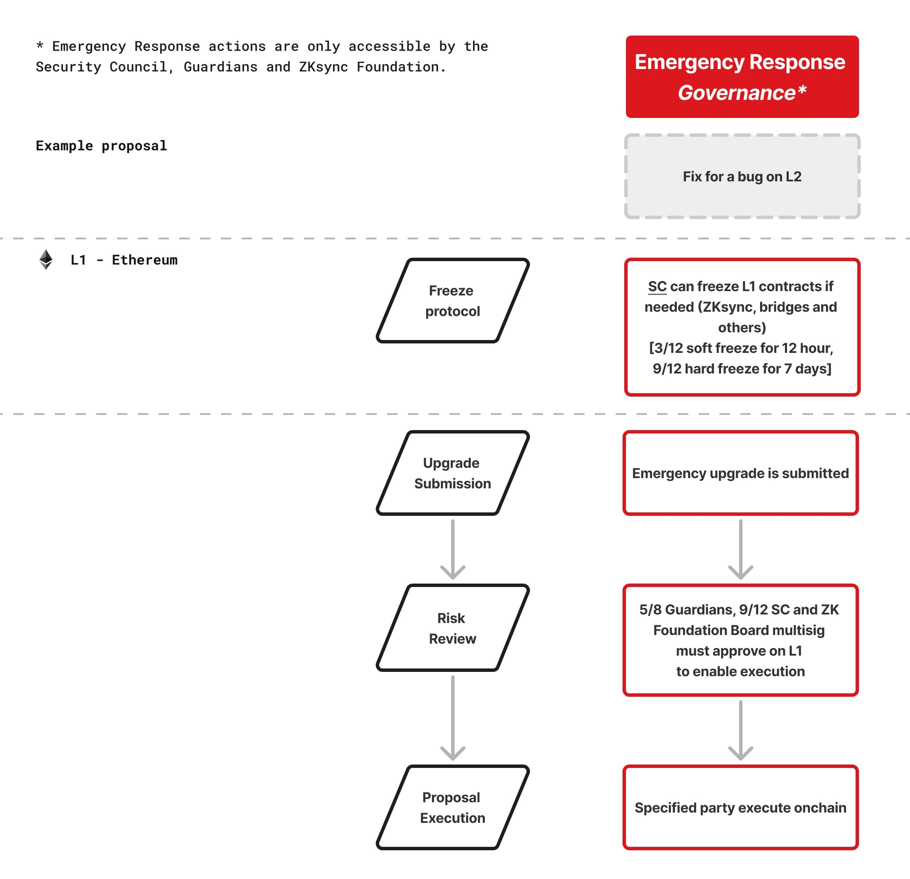

# Proposal Type Overview

What is the standard proposal process for each proposal type?

Each proposal type has their own specific process given the parameters set on the governor and differences in the execution process. The proposal standard processes for each proposal type are outlined in [Schedule 1: Standard Governance Procedures](https://docs.zknation.io/zksync-governance/schedule-1-standard-governance-procedures).

**Proposal Parameters Overview**

<figure><figcaption></figcaption></figure>

> ℹ️ Learn more about the [voting extension period](https://forum.zknation.io/t/understanding-the-voting-extension/698) and how it works for each proposal type.&#x20;

**ZIP Process & Timeline**

<figure><figcaption></figcaption></figure>

**TPP Process & Timeline**

<figure><figcaption></figcaption></figure>

**GAP Process & Timeline**

<figure><figcaption></figcaption></figure>

#### What is the proposal process for emergency upgrades?

The proposal standard processes for each proposal type are outlined in [Schedule 2: Emergency Response Procedures](https://docs.zknation.io/zksync-governance/schedule-2-emergency-response-procedures)**.**

<figure><figcaption></figcaption></figure>
